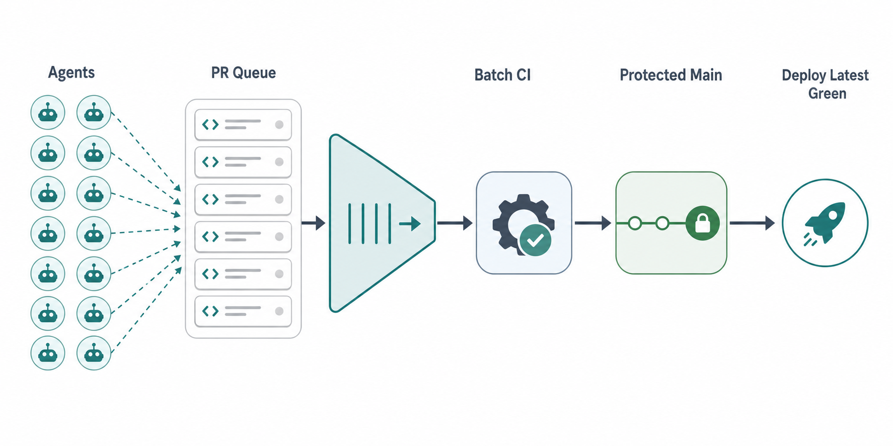

# Agent Merge Batch Protocol

Matthew Berman is an AI educator and creator focused on making AI and emerging technology more accessible. In the reference post below, he described a practical coding-agent bottleneck: many agents finish PRs, 5-8 are ready to land, then asking each agent to "deploy" makes them all contend for `main`. With about 2 minutes of CI per merge, later PRs get stuck in stale-branch, lock, rebase, and retry loops until the fifth, sixth, or seventh PR can take an hour or more to land.

https://x.com/matthewberman/status/2068106301402755268

This repo is a public research note and reproducible validation artifact for that merge bottleneck.

It also includes agent-ready instructions in [AGENTS.md](AGENTS.md) and [examples/agent-instructions.md](examples/agent-instructions.md), so people can ask Claude, Codex, or another coding agent to adapt and apply the approach in their own environment with checks and stop conditions.

## Goal

Land 5-8 ready agent PRs in minutes, not an hour, without letting many agents fight over `main`.

## Proposed solution

Workers do not merge. A single merge coordinator or merge queue owns the protected write path to `main`.



Concept visual generated with GPT Image 2.

The practical protocol:

1. Workers open PRs and stop after posting a structured merge request.
2. The coordinator forms a compatible batch of ready PRs.
3. CI validates the synthetic integration branch or merge group.
4. A clean batch lands together.
5. A failing batch is split until bad PRs are isolated.
6. Production deploys the newest green `main` commit, separately from PR merge validation.

This can be implemented with GitHub merge queue, Graphite, Mergify batch queues, or a custom coordinator that creates temporary integration branches.

## Simplified test results

Model assumptions: 2 minute CI per integration attempt, 2 seconds merge overhead, 10 minute target.

| Scenario | Naive parallel deploy | Serial merge agent | Batched queue |
| --- | ---: | ---: | ---: |
| 8 clean PRs, batch 8 | 72m 16s | 16m 16s | 2m 16s |
| 16 clean PRs, batch 8 | 152m 32s | 32m 32s | 4m 32s |
| 40 clean PRs, batch 8 | 393m 20s | 81m 20s | 11m 20s |
| 40 clean PRs, batch 16 | 393m 20s | 81m 20s | 7m 20s |

Failure isolation matters:

| Scenario | Result |
| --- | --- |
| 8 PRs, 1 bad PR, batch 8 with parallel split | 7 good landed, 1 isolated, 8m 02s |
| 16 PRs, 1 bad PR, batch 16 with parallel split | 15 good landed, 1 isolated, 10m 02s |
| 40 PRs, 1 bad PR, batch 16 with parallel split | 39 good landed, 1 isolated, 14m 50s |

Real-repo validation was also run against an npm workspace application in an isolated clone:

| Real validation | Result |
| --- | --- |
| 8 synthetic PR branches, real web test command | 1 integration test run, target passed |
| 5 synthetic PR branches, 1 injected bad branch | 4 good branches landed, bad branch isolated, target passed |

The real-repo source path and scratch outputs are intentionally not included in this public repository.

## Run the checks

```bash
python3 tests/merge_benchmark.py --prs 8 --ci-seconds 120 --target-seconds 600 --batch-size 8 --parallel-split
python3 tests/git_batch_proof.py --prs 8 --ci-seconds 120 --parallel-split
python3 scripts/scan_public_safety.py .
```

## What this is not

This is not a claim that a prompt or `AGENTS.md` file alone solves the problem. Agent instructions stop workers from making the bottleneck worse. The throughput comes from protected ownership of `main`, synthetic integration validation, batching, and failure isolation.

See:

- [Research summary](docs/research.md)
- [Protocol approach](docs/approach.md)
- [Validation notes](docs/validation.md)
- [Safe application guide](docs/apply-safely.md)
- [Agent instructions template](examples/agent-instructions.md)

## License

Apache-2.0. See [LICENSE](LICENSE).
